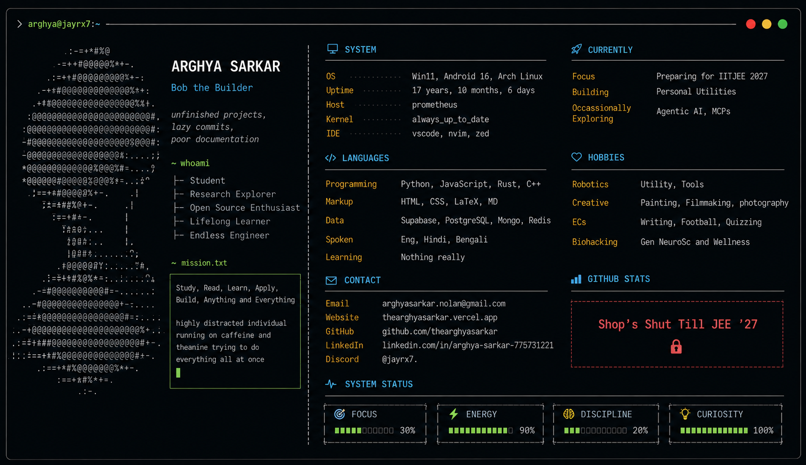

<div align="center">

<br>

# arghya here.
`@argparse`

*Student · Research Explorer · Open Source Enthusiast*

*"Every repository here began with a stupid question."*

</div>

<br>


```bash
Email      arghyasarkar.nolan@gmail.com
Website    https://thearghyasarkar.vercel.app
GitHub     @thearghyasarkar
LinkedIn   arghya-sarkar-775731221
Discord    @jayrx7.
```

I don't build projects because I already know how.

I build them because I don't, therefore you're in tough luck if you're finding in my profile fifty "Build Your Own Xs" and "Learn Y in 30 Days" repositories.

I love being clueless about my ideas from the very beginning, and explore new horizons all the time. 

<div align=center>
Internet is simply where I document those investigations.<br>
Sometimes they become useful software. <br>
Sometimes they fail spectacularly.<br>
Both outcomes stay here, trust me.
</div>
<br><br>


# Philosophy

```bash
$ cat ~/.philosophy

because curiosity > credentials

while true; do
    study
    read
    learn
    apply
    build
    document
done

# TODO:
# finish at least one side project before starting three more.
```

Documentation is as valuable as work.<br> I did not set the rules,

<div align=center> <br> Da Vinci did. Nikola Tesla did. <br> Darwin did. Junkers did.

</div><br>

And curiosity is a better long-term motivator than chasing technologies.

<br>

# Areas of Curiosity

| Domain | Current Focus |
|---------|---------------|
| Artificial Intelligence | AI Agents, Neural Networks, Big Data Operability |
| Systems | Linux, Networking, Compilers (*rusty*) |
| Web | Next.js, Databases, APIs, and all things Claude sucks at |
| Embedded | ESP32, XinoSENSE, PCBs (still a beginner) |
| Mathematics | Algorithms, Statistics, Calculus |
| Writing | Technical Documentation, Essays, Blogs, Occassional Literature |
| Research | None, currently. |

---

<br>

Outside the standard tech headers, I'm interested in design, photography, filmmaking, mathematics, psychology, philosophy and literature.

Those subjects influence my engineering just as much as programming does.

<br>


# What's Here

Not too complex, any major projects I make I'll pin them up, else for the larger part, you'll find unfinished thoughts,

Half-built experiments.<br>
    Research notes.<br>
Design sketches.<br>
Questions without answers.<br>

That's intentional.
<br><br>

# Let's Connect

I'm always happy to talk about

- interesting ideas
- strange bugs
- open source
- Linux
- AI
- research
- software architecture

If something here sparks a conversation, feel free to reach out to me by mail.

---

<div align="center">

### Stay curious.

*"The best projects start as questions."*

</div>